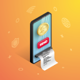
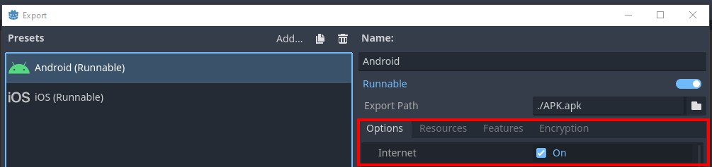
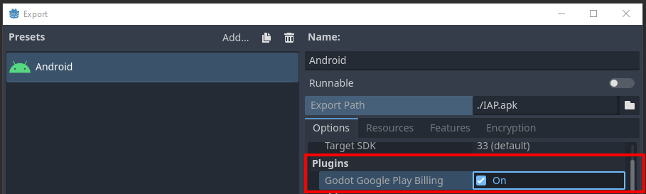
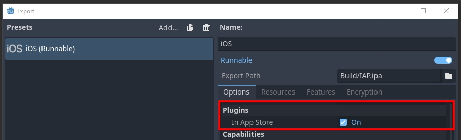
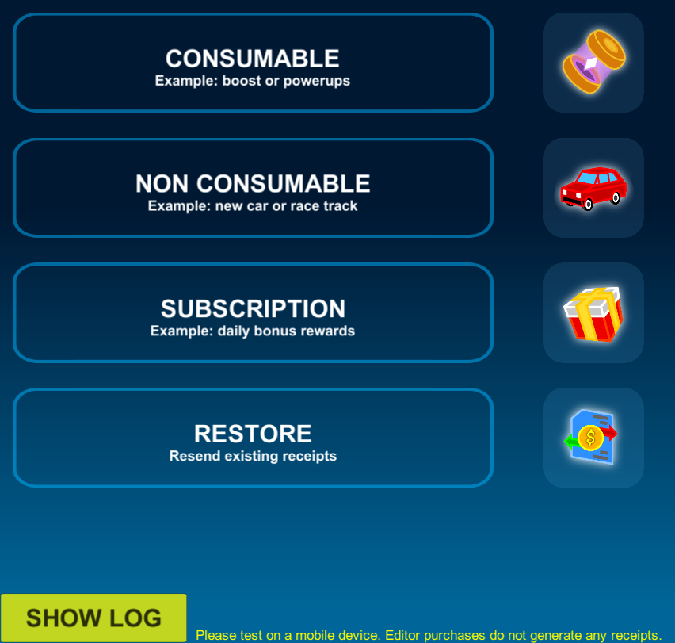
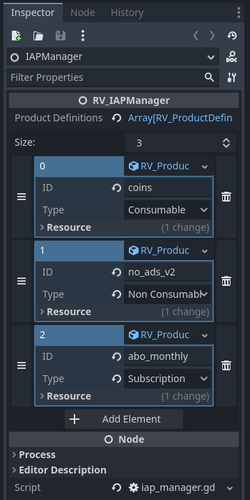
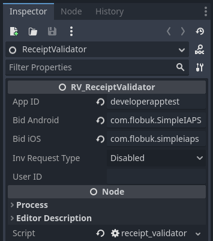
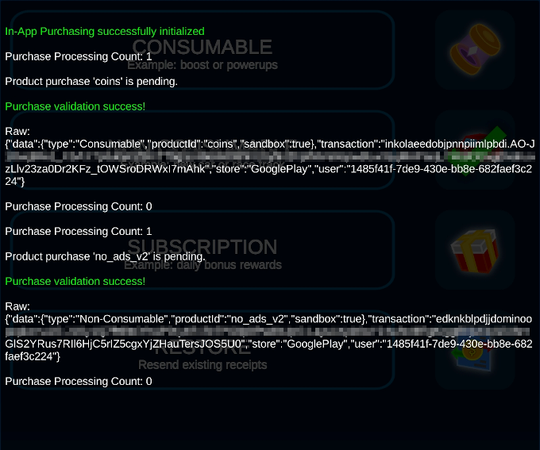

# Receipt Validator SDK

  

A sample project for the Godot game engine, that contains fully working in-app purchase implementations including server-side receipt validation for the Apple App Store and Google Play. The [Receipt Validator Service](https://flobuk.com/validator) is a fully hosted solution, so you do not have to manage your own server or keep track of transactions and App Store API changes. The service offers a FREE plan to get started. 

**Requirements:**
- You have created a free account on the [Receipt Validator Service](https://flobuk.com/validator)
- You have created a new app in the Receipt Validator dashboard
- You should have set up your app and products on the App Store(s) already prior to running this project

## Table of Contents

1. [Project Setup](#project-setup)
    1. [Google Play](#google-play)
    2. [Apple App Store](#apple-app-store)
2. [Installation](#installation)
3. [Usage](#usage)
5. [Testing](#testing)
6. [Integration](#integration)
7. [Missing Features](#missing-features)
8. [Support](#support)

## Project Setup

### Google Play

You should have created a [Google Play Developer Account](https://play.google.com/apps/publish/signup/), added an application and created in-app purchases for it.

In Godot, you have followed the [Exporting for Android](https://docs.godotengine.org/en/stable/tutorials/export/exporting_for_android.html) guidelines and added an Android export template. Further down in its *Options* tab, enable the `Internet` permissions. This is required for sending your in-app purchase receipt to the Receipt Validator backend. If you make use of the Receipt Validator's User Inventory feature, the `Read External Storage` and `Write External Storage` permissions are required as well.

Download or compile the [GodotGooglePlayBilling](https://github.com/godotengine/godot-google-play-billing) plugin and put the files in your project's `res://android/plugins` folder. Optionally, use the files the plugin is shipped with in the `android/plugins` folder. In your Android Export Template, a new checkbox shows up which you have to enable.

### Apple App Store

You should have enrolled in the [Apple Developer Program](https://developer.apple.com/programs/enroll/), added an application and created in-app purchases for it.

In Godot, you have followed the [Exporting for iOS](https://docs.godotengine.org/en/stable/tutorials/export/exporting_for_ios.html) guidelines and added an iOS export template.

Compile the [InAppStore plugin](https://github.com/godotengine/godot-ios-plugins) and put the files in your project's `res://ios/plugins` folder. Optionally, use the files the plugin is shipped with in the `ios/plugins` folder. In your iOS Export Template, a new checkbox shows up which you have to enable.

## Installation

1. Get this plugin from the Asset Library or from GitHub and import its `addons` folder into your project
2. Add the `IAPManager` and `ReceiptValidator` scenes as Autoload

## Usage

The `demo` scene provides buttons for buying each type of in-app product, along with a way to restore transactions. The logic for this is in the `demo_ui` GDScript.

If you wish to use your own products in the `demo` scene, open the `IAPManager` autoload scene and add new products or modify the existing ones. The **ID** you enter here is the product identifier from the App Store.

Likewise, open the `ReceiptValidator` autoload scene and enter your own **App ID** from the Receipt Validator Service, as well as the correct bundle identifiers for your app from the Apple/Google Play Store. 

## Testing

Since the Godot Editor does not have any connection to App Stores, you are not able to test purchases using it. In the `demo` scene, a message is shown mentioning this too. You have to test on a real device that is actually able to receive valid receipts and transactions from the App Stores.

> **PLEASE NOTE:** Guides on how to upload your application to the App Stores, or creating test users for Sandbox purchasing is out of scope for this document. If you need help with that, please contact us (see [Support](#support)). 

When running on a real device you will be able to fully test all purchase validation workflows. Press the **SHOW LOG** button to display an informative console about web requests. In the following screenshot, a consumable and non-consumable product have been bought and validated. If you make use of the Receipt Validator's User Inventory feature, the non-consumable product will be returned for that user in subsequent app launches as well.

## Integration

**IAPManager:**
You can either rewrite the `IAPManager` GDScript to fit into your game coding, or use it as-is. This script offers a **purchase_callback** signal that you would want to subscribe to, in order to define what happens when a purchase event is received. Check that the *success* boolean is true before accessing the *data* Dictionary and granting the corresponding product to the player. Note that the *data* Dictionary will return only the product ID, if the purchase was restored, or if server validation was disabled or does not support the build platform.

It is recommended to save successful purchases in an encrypted file locally, so you can access them at any time and players can also use them when playing offline.

**ReceiptValidator:**
The `ReceiptValidator` GDScript offers a **purchase_callback** signal for the web response as well - when using your own `IAPManager`, it should subscribe to this. Also, a **inventory_callback** signal that has not been used in this demo. If you are making use of the Receipt Validator User Inventory feature, you would subscribe to this signal after player authentication and `ReceiptValidator` initialization, call *ReceiptValidator.request_inventory()* and act on the products and status it returns.

## Missing Features

The purpose of this SDK is to quickly get up and running with in-app purchases and server-side receipt validation, while keeping it as simple as possible for you to extend and build upon.

A paid plugin for in-app purchases supporting:
- category, product and virtual currency management right in the Godot Editor
- automatic handling of virtual product purchases (for virtual currency)
- product overrides for different App Store IDs
- local storage of purchases for offline use
- several shop scenes for vertical or horizontal item alignment

in addition to built-in support for server-side receipt validation, will be released on the official Godot Asset Store once it is launched. 

## Support

This plugin was specifically designed to be used in combination with the [Receipt Validator Service](https://flobuk.com/validator). For integration assistance or questions about the Service, please open a ticket at the **Support** tab in the Receipt Validator dashboard.